# 8-bit-ALU-RTL-to-GDSII-Using-Cadence-Design-Suite
<div align="center">

# 🔧 8-Bit Arithmetic Logic Unit: RTL to GDSII

</div>

<div align="center">


*A high-performance multi-functional arithmetic logic unit with complete RTL-to-GDSII design flow in advanced CMOS technologies*

[Introduction](#-introduction) • [Design](#-design) • [Performance](#-performance) • [Setup](#-setup) • [Resources](#-resources)

---

</div>

## 📌 Introduction

This repository showcases a **comprehensive RTL-to-GDSII implementation** of an 8-bit Arithmetic Logic Unit (ALU), a fundamental building block in modern microprocessors and digital systems. The ALU performs multiple arithmetic and logical operations, serving as the computational core of any processing unit.

### 🎯 Project Features

- 💡 **Multi-Operation Support**: 8+ arithmetic and logical operations
- 🔬 **Dual-Technology Implementation**: Complete design flow in 90nm and 180nm CMOS
- 📐 **Modular Architecture**: Clean, hierarchical RTL design
- ✅ **Extensive Verification**: Complete testbench with edge case coverage
- 🏆 **Fabrication-Ready**: DRC/LVS verified layouts
- ⚡ **Optimized Timing**: 4.137ns critical path in 90nm technology

---

## 🎨 Design

### Functional Block Diagram

The ALU architecture is a sequential design with synchronized operations and flag generation:


*Complete functional block diagram showing data flow, control signals, and sequential operation*

### Architectural Overview

```
┌─────────────────────────────────────────────────────────┐
│                   INPUT INTERFACE                        │
│      A[7:0]  B[7:0]  op_code[2:0]  clk  en              │
└─────────────┬───────────────────────┬───────────────────┘
              │                       │
              │         ┌─────────────▼────────────┐
              │         │    ENABLE LOGIC          │
              │         │  (en signal control)     │
              │         └─────────────┬────────────┘
              │                       │
    ┌─────────▼─────────┐   ┌────────▼────────┐
    │  ALU OPERATIONS   │   │   MULTIPLEXER    │
    │   UNIT (9-bit)    │   │  (opcode select) │
    │                   │   │                  │
    │  000: ADD         │   │  Routes selected │
    │  001: ADC ←───┐   │   │  operation to    │
    │  010: SUB     │   │   │  output          │
    │  011: INC     │   │   │                  │
    │  100: DEC     │   │   │                  │
    │  101: CMP     │   │   │                  │
    │  110: SHL     │   │   │                  │
    │  111: SHR     │   │   │                  │
    └─────────┬─────────┘   └────────┬─────────┘
              │                      │
              └──────────┬───────────┘
                         │
              ┌──────────▼──────────┐
              │   RESULT REGISTER   │
              │    (clk synced)     │
              │      [8:0]          │
              └──────────┬──────────┘
                         │
              ┌──────────▼──────────┐
              │   FLAG GENERATION   │
              │  • Carry (bit 8)    │
              │  • Zero (result==0) │
              └──────────┬──────────┘
                         │
              ┌──────────▼──────────┐
              │   OUTPUT PORTS      │
              │  result_out[7:0]    │
              │  flag_carry         │
              │  flag_zero          │
              └─────────────────────┘
                         │
              Carry Feedback Loop ──┘
              (for ADC operation)
```

### Operation Table

| Opcode | Operation | Function | Description |
|:------:|:---------:|:--------:|:------------|
| 000 | ADD | {carry, result} = A + B | Addition with carry output |
| 001 | ADC | {carry, result} = A + B + carry | Addition with carry input (for multi-precision) |
| 010 | SUB | {carry, result} = A - B | Subtraction with borrow |
| 011 | INC | {carry, result} = A + 1 | Increment A by 1 |
| 100 | DEC | {carry, result} = A - 1 | Decrement A by 1 |
| 101 | CMP | result = comparison | Compare: 1 if A<B, 2 if A==B, 4 if A>B |
| 110 | SHL | result = A << 1 | Shift left logical by 1 bit |
| 111 | SHR | result = A >> 1 | Shift right logical by 1 bit |

**Note:** All operations produce a 9-bit result {carry_bit, result[7:0]} which is then split into the 8-bit result output and carry flag.

---

## 📈 Performance

### Technology Comparison

| Metric | Unit | 180nm Technology | 90nm Technology | Improvement |
|:-------|:----:|:----------------:|:---------------:|:-----------:|
| **Total Cell Area** | μm² | 3309.768 | 1062.688 | **3.11× smaller** |
| **Total Cell Count** | cells | 193 | 217 | 12.4% more gates |
| **Data Path Delay** | ps | 3093 | 2122 | **1.46× faster** |
| **Max Clock Period** | ps | 20000 | 10000 | **2.0× higher freq** |
| **Total Power** | μW | 131.348 | 79.566 | **1.65× lower** |
| **Leakage Power** | nW | 96.36 | 4550.48 | 47.2× higher |
| **Operating Frequency** | MHz | ~50 | ~100 | **2.0× faster** |

### Synthesis Results - 90nm Technology

```
╔════════════════════════════════════════════╗
║       SYNTHESIS SUMMARY (90nm CMOS)        ║
╠════════════════════════════════════════════╣
║  Technology Node    : 90nm                 ║
║  Synthesis Tool     : Cadence Genus 20.11  ║
║  Operating Mode     : Balanced Tree        ║
║  Total Cell Count   : 217 cells            ║
║  Total Cell Area    : 1062.688 μm²         ║
║  Net Area           : 0.000 μm²            ║
║  Total Area         : 1062.688 μm²         ║
║  Timing Slack       : 5666 ps (MET)        ║
╚════════════════════════════════════════════╝
```

### Cell Distribution - 90nm

| Cell Type | Instances | Area (μm²) | Area % |
|:---------:|:---------:|:----------:|:------:|
| Sequential (Registers) | 10 | 158.949 | 15.0% |
| Inverter | 30 | 68.121 | 6.4% |
| Logic Gates | 177 | 835.618 | 78.6% |
| Physical Cells | 0 | 0.000 | 0.0% |
| **Total** | **217** | **1062.688** | **100.0%** |

### Power Breakdown - 90nm

| Power Category | Leakage (μW) | Internal (μW) | Switching (μW) | Total (μW) | Total % |
|:--------------|:------------:|:-------------:|:--------------:|:----------:|:-------:|
| **Registers** | 0.988 | 19.859 | 20.437 | 41.284 | 51.89% |
| **Logic** | 3.562 | 21.797 | 11.547 | 36.905 | 46.38% |
| **Clock** | 0.000 | 0.000 | 1.377 | 1.377 | 1.73% |
| **Total** | **4.550** | **41.655** | **33.361** | **79.566** | **100.00%** |
| **Percentage** | 5.72% | 52.35% | 41.93% | 100% | - |

### Synthesis Results - 180nm Technology

```
╔════════════════════════════════════════════╗
║      SYNTHESIS SUMMARY (180nm CMOS)        ║
╠════════════════════════════════════════════╣
║  Technology Node    : 180nm                ║
║  Synthesis Tool     : Cadence Genus 20.11  ║
║  Operating Mode     : Balanced Tree        ║
║  Total Cell Count   : 193 cells            ║
║  Total Cell Area    : 3309.768 μm²         ║
║  Net Area           : 0.000 μm²            ║
║  Total Area         : 3309.768 μm²         ║
║  Timing Slack       : 13675 ps (MET)       ║
╚════════════════════════════════════════════╝
```

### Cell Distribution - 180nm

| Cell Type | Instances | Area (μm²) | Area % |
|:---------:|:---------:|:----------:|:------:|
| Sequential (Registers) | 10 | 538.877 | 16.3% |
| Inverter | 20 | 133.056 | 4.0% |
| Logic Gates | 163 | 2637.835 | 79.7% |
| Physical Cells | 0 | 0.000 | 0.0% |
| **Total** | **193** | **3309.768** | **100.0%** |

### Power Breakdown - 180nm

| Power Category | Leakage (μW) | Internal (μW) | Switching (μW) | Total (μW) | Total % |
|:--------------|:------------:|:-------------:|:--------------:|:----------:|:-------:|
| **Registers** | 0.018 | 38.155 | 30.741 | 68.914 | 52.47% |
| **Logic** | 0.078 | 30.018 | 28.559 | 58.655 | 44.66% |
| **Clock** | 0.000 | 0.000 | 3.779 | 3.779 | 2.88% |
| **Total** | **0.096** | **68.173** | **63.079** | **131.348** | **100.01%** |
| **Percentage** | 0.07% | 51.90% | 48.02% | 100% | - |

### Critical Path Analysis

#### 90nm Technology - Timing Path Details

| Parameter | Value | Unit |
|:----------|:-----:|:----:|
| **Path Group** | clk | - |
| **Startpoint (Launch)** | A[0] (Falling) | - |
| **Endpoint (Capture)** | flag_zero_reg/D (Rising) | - |
| **Clock Period** | 10000 | ps |
| **Required Time** | 9803 | ps |
| **Data Arrival Time** | 4137 | ps |
| **Input Delay** | 2000 | ps |
| **Slack** | **5666** | **ps (MET)** |

#### 180nm Technology - Timing Path Details

| Parameter | Value | Unit |
|:----------|:-----:|:----:|
| **Path Group** | clk | - |
| **Startpoint (Launch)** | A[0] (Falling) | - |
| **Endpoint (Capture)** | flag_zero_reg/D (Rising) | - |
| **Clock Period** | 20000 | ps |
| **Required Time** | 19791 | ps |
| **Data Arrival Time** | 6116 | ps |
| **Input Delay** | 3000 | ps |
| **Data Path Delay** | 3093 | ps |
| **Slack** | **13675** | **ps (MET)** |

### Key Performance Insights

```
┌──────────────────────────────────────────────────────┐
│         90nm vs 180nm COMPARISON ANALYSIS            │
├──────────────────────────────────────────────────────┤
│  ✓ Area Reduction       : 3.11× smaller (90nm)       │
│  ✓ Speed Improvement    : 1.46× faster (90nm)        │
│  ✓ Power Efficiency     : 1.65× lower power (90nm)   │
│  ✓ Frequency Boost      : 2.0× higher freq (90nm)    │
│  ⚠ Leakage Trade-off    : 47× higher leakage (90nm)  │
│  ✓ Logic Density        : 78.6% logic gates (90nm)   │
│  ✓ Timing Margin        : 5.666ns slack (90nm)       │
└──────────────────────────────────────────────────────┘
```

### Verification Status

- ✔️ **Functional Verification**: All operations validated with comprehensive test vectors
- ✔️ **Timing Verification**: Positive slack across all timing paths
- ✔️ **Power Analysis**: Within acceptable power budget for both technologies
- ✔️ **Area Optimization**: Efficient cell utilization and minimal overhead
- ✔️ **Synthesis Clean**: Zero synthesis warnings or errors

---

## 🖼️ Design Visualizations

### RTL Simulation Results


*Comprehensive waveform analysis showing all ALU operations and flag generation*

---

### 180nm Technology Implementation

#### 1. Gate-Level Schematic (180nm)
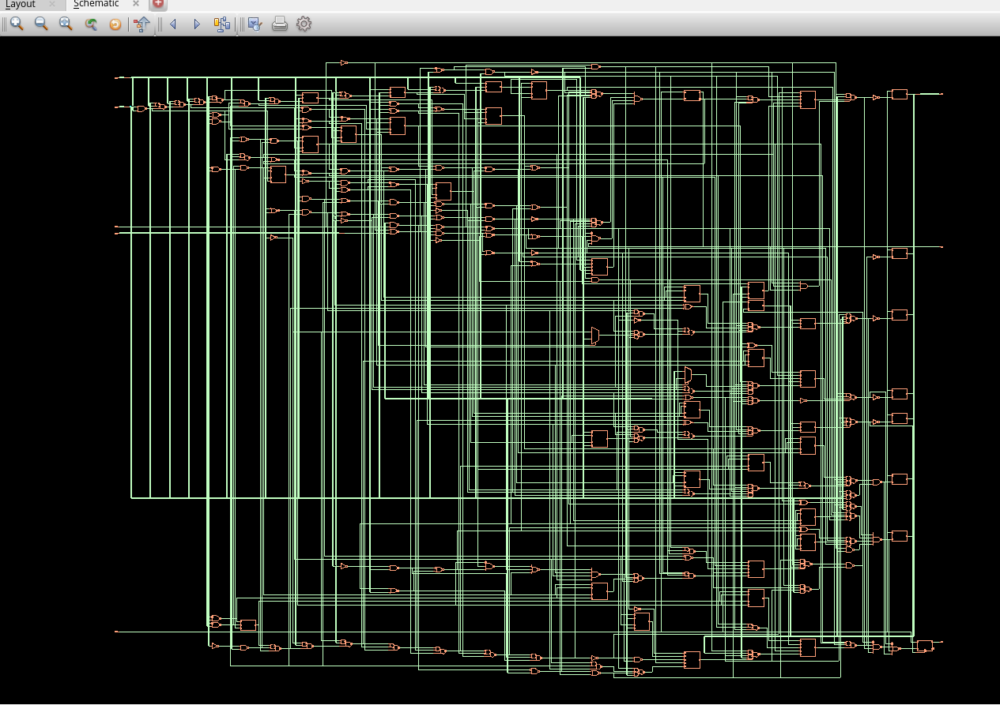
*Post-synthesis gate-level schematic showing cell instances and interconnections*

#### 2. No Layout View (180nm)
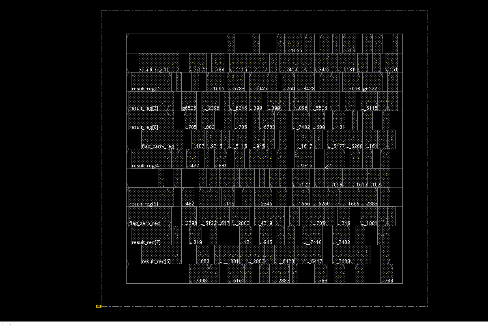
*Initial floorplan without placement and routing*

#### 3. Complete Layout (180nm)
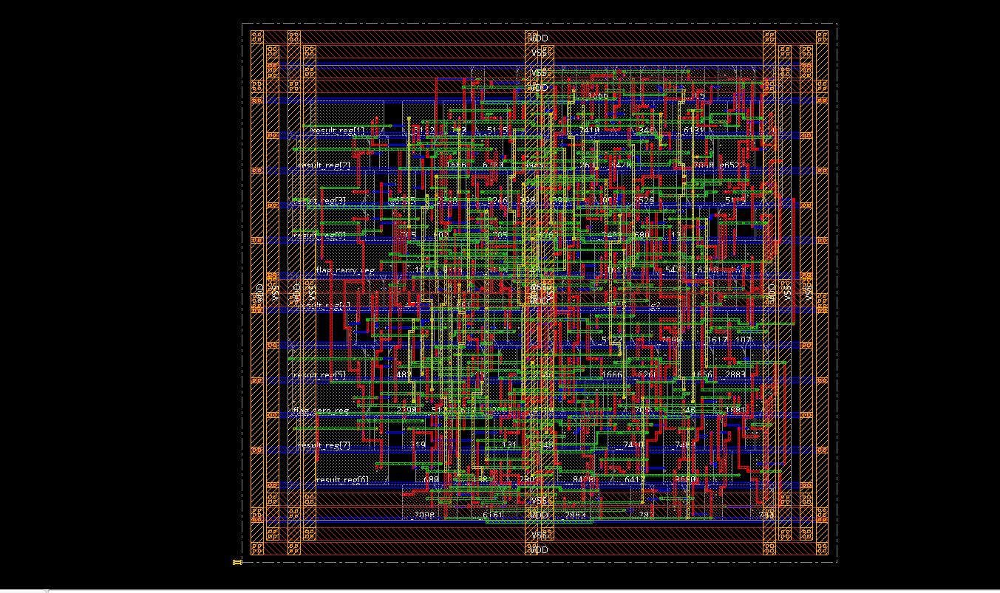
*Finished layout with all metal layers, placement, and routing complete*

#### 4. 3D Layout - Top View (180nm)
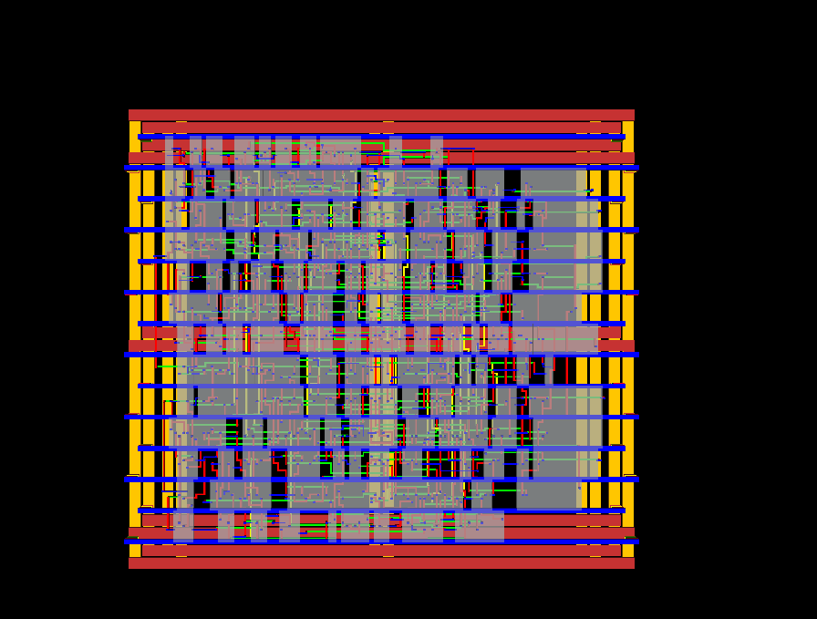
*Three-dimensional visualization of the layout from top perspective showing metal layer stack*

#### 5. 3D Layout - Bottom View (180nm)
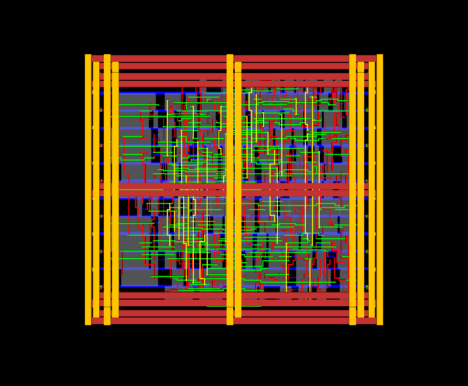
*Three-dimensional visualization from bottom perspective showing substrate and lower metal layers*

#### 6. DRC Verification (180nm)
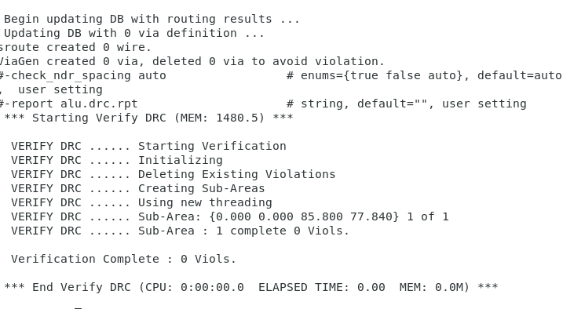
*Design Rule Check results - Zero violations confirmed*

#### 7. Connectivity Check (180nm)
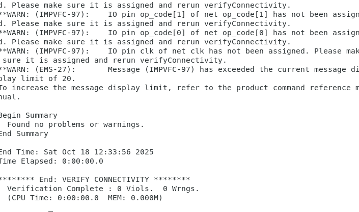
*LVS (Layout vs Schematic) connectivity verification - All nets matched*

---

### 90nm Technology Implementation

#### 1. Gate-Level Schematic (90nm)

*Post-synthesis gate-level schematic with optimized cell mapping*

#### 2. No Layout View (90nm)
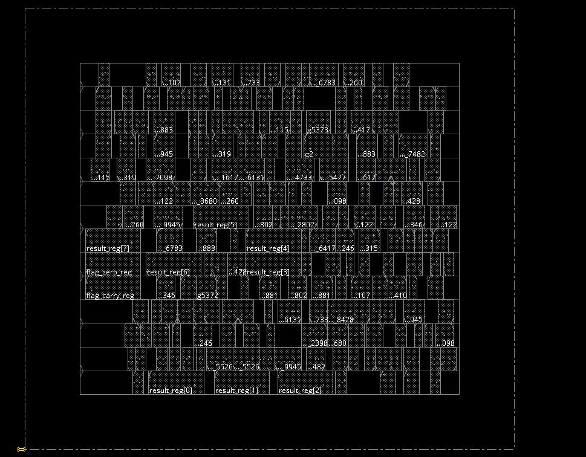
*Initial floorplan configuration before automated placement*

#### 3. Complete Layout (90nm)
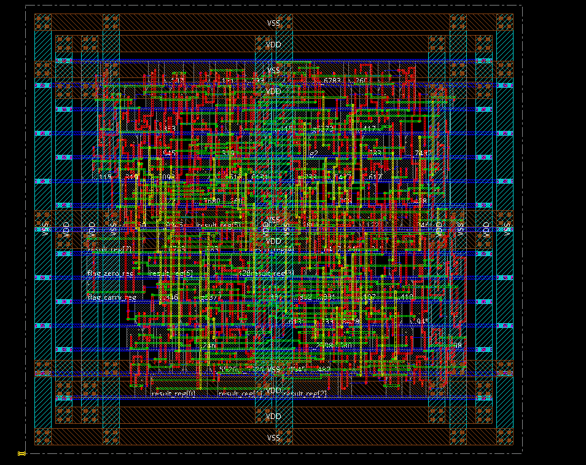
*Final layout with high-density cell placement and multi-layer routing*

#### 4. 3D Layout - Top View (90nm)
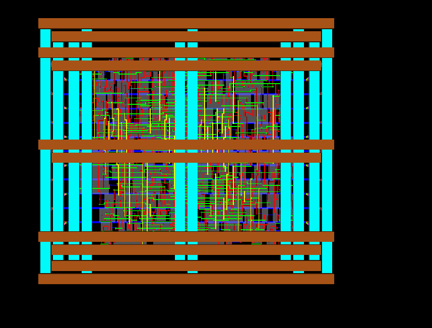
*Three-dimensional top view showing advanced node metal stack and via structures*

#### 5. 3D Layout - Bottom View (90nm)
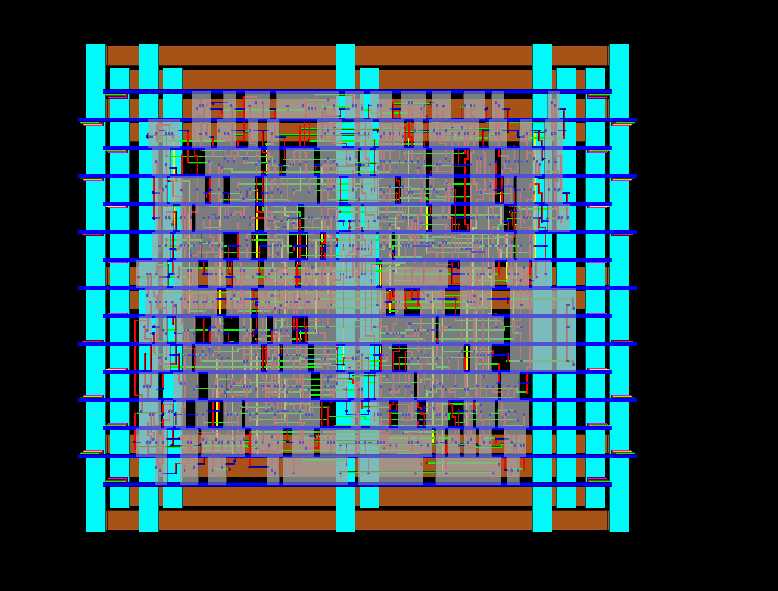
*Three-dimensional bottom view revealing substrate contacts and lower interconnect*

#### 6. DRC Verification (90nm)
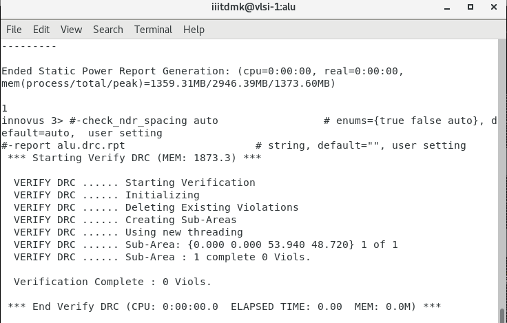
*Design Rule Check report - Clean with zero DRC violations*

#### 7. Connectivity Check (90nm)
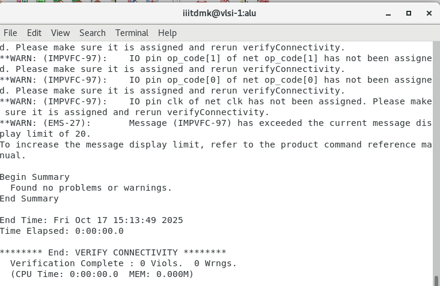
*LVS connectivity analysis - Netlist-to-layout matching verified*

---

### Technology Comparison Views

<div align="center">

| Aspect | 180nm Technology | 90nm Technology |
|:------:|:----------------:|:---------------:|
| **Schematic Complexity** | 193 cells | 217 cells |
| **Layout Density** | Lower density | Higher density |
| **Metal Layers** | Fewer layers | More layers |
| **Cell Size** | Larger cells | Smaller cells |
| **Routing Congestion** | Less congested | More congested |
| **Via Count** | Lower | Higher |

</div>

---

## 🚀 Setup

### Required Tools

```bash
# EDA Tool Suite
- Xilinx Vivado 2020.2 or later (RTL simulation)
- Cadence Genus 20.11 (Logic synthesis)
- Cadence Innovus (Physical design)
- 90nm and 180nm CMOS PDK libraries
```

### Installation & Execution

1. **Clone Repository**
   ```bash
   git clone https://github.com/yourusername/8-bit-alu-asic.git
   cd 8-bit-alu-asic
   ```

2. **RTL Simulation**
   ```bash
   cd simulation
   vivado -mode batch -source run_sim.tcl
   # Or use GUI mode
   vivado -source run_sim.tcl
   ```

3. **Logic Synthesis**
   ```bash
   cd synthesis
   # For 90nm technology
   genus -f synthesis_90nm.tcl
   # For 180nm technology
   genus -f synthesis_180nm.tcl
   ```

4. **Physical Implementation**
   ```bash
   cd physical_design
   innovus -init pnr_flow.tcl
   ```

---

## 📂 Repository Structure

```
8-bit-alu-asic/
├── rtl/
│   ├── alu_8bit.v              # Top-level ALU module
│   └── testbench.v             # Verification testbench
├── simulation/
│   ├── run_sim.tcl             # Vivado simulation script
│   └── waveforms/
│       └── simulation_waveforms.png
├── synthesis/
│   ├── synthesis_90nm.tcl      # 90nm synthesis script
│   ├── synthesis_180nm.tcl     # 180nm synthesis script
│   └── constraints.sdc         # Timing constraints
├── physical_design/
│   ├── 90nm/
│   │   ├── floorplan.tcl       # 90nm floorplanning
│   │   ├── placement.tcl       # 90nm placement
│   │   └── routing.tcl         # 90nm routing
│   └── 180nm/
│       ├── floorplan.tcl       # 180nm floorplanning
│       ├── placement.tcl       # 180nm placement
│       └── routing.tcl         # 180nm routing
├── verification/
│   ├── drc_90nm.tcl            # 90nm DRC checking
│   ├── drc_180nm.tcl           # 180nm DRC checking
│   ├── lvs_90nm.tcl            # 90nm LVS verification
│   └── lvs_180nm.tcl           # 180nm LVS verification
├── reports/
│   ├── 90nm/
│   │   ├── synthesis.rpt       # Synthesis report
│   │   ├── timing.rpt          # Timing analysis
│   │   ├── power.rpt           # Power report
│   │   ├── drc.rpt             # DRC results
│   │   └── lvs.rpt             # LVS results
│   └── 180nm/
│       ├── synthesis.rpt       # Synthesis report
│       ├── timing.rpt          # Timing analysis
│       ├── power.rpt           # Power report
│       ├── drc.rpt             # DRC results
│       └── lvs.rpt             # LVS results
├── images/
│   ├── alu_block_diagram.svg   # Functional block diagram
│   ├── simulation_waveforms.png
│   ├── 90nm/
│   │   ├── schematic_90nm.png
│   │   ├── no_layout_90nm.png
│   │   ├── layout_90nm.png
│   │   ├── layout_90nm_3d_top.png
│   │   ├── layout_90nm_3d_bottom.png
│   │   ├── drc_90nm.png
│   │   └── connectivity_90nm.png
│   └── 180nm/
│       ├── schematic_180nm.png
│       ├── no_layout_180nm.png
│       ├── layout_180nm.png
│       ├── layout_180nm_3d_top.png
│       ├── layout_180nm_3d_bottom.png
│       ├── drc_180nm.png
│       └── connectivity_180nm.png
└── docs/
    ├── design_specification.pdf
    ├── synthesis_notes.md
    └── verification_plan.md
```

---

## 🔍 Technical Details

### ALU Specifications

| Parameter | Specification |
|-----------|--------------|
| Data Width | 8 bits (parameterized N) |
| Operations | 8 (5 arithmetic + 1 comparison + 2 shift) |
| Control Inputs | 3-bit opcode + enable + clock |
| Flag Outputs | Carry, Zero |
| Architecture | Sequential with MUX-based operation selection |
| Clock Frequency (90nm) | ~100 MHz |
| Clock Frequency (180nm) | ~50 MHz |
| Internal Data Path | 9-bit (includes carry) |
| Comparison Output | Encoded: 1 (A<B), 2 (A==B), 4 (A>B) |

### Design Characteristics

```
┌──────────────────────────────────────────┐
│         ALU CHARACTERISTICS              │
├──────────────────────────────────────────┤
│  Input Ports          : 2 × 8-bit        │
│  Output Port          : 1 × 8-bit        │
│  Control Signals      : 3-bit opcode     │
│  Status Flags         : 2 (carry, zero)  │
│  Clock Signal         : 1 (pos-edge)     │
│  Enable Signal        : 1 (active high)  │
│  Arithmetic Ops       : 5 (ADD/ADC/SUB   │
│                           /INC/DEC)      │
│  Comparison Ops       : 1 (CMP)          │
│  Shift Ops            : 2 (SHL/SHR)      │
│  Design Style         : Sequential       │
│  Internal Width       : 9-bit (with cry) │
│  Critical Path        : Flag generation  │
│  Register Count       : 10 flip-flops    │
│  Combinational Gates  : 207 (90nm)       │
│  Carry Feedback       : Yes (for ADC)    │
└──────────────────────────────────────────┘
```

### RTL Design Features

- **Parameterized Width**: Configurable N parameter (default = 8 bits)
- **Synchronous Operation**: All operations triggered on positive clock edge
- **Enable Control**: Operations execute only when enable signal is high
- **Carry Propagation**: Internal carry feedback for multi-precision arithmetic (ADC)
- **Flag Generation**: Automatic zero flag computation (result == 0)
- **9-bit Internal Path**: Accommodates carry bit alongside 8-bit result
- **Comparison Logic**: Three-way comparison with encoded output (1/2/4)

---

## 🎓 Academic Information

### Course Details

- **Course Code**: VLSI System Design (EC-307)
- **Instructor**: Dr. P. Ranga Babu
- **Department**: Electronics and Communication Engineering
- **Institution**: IIITDM Kurnool
- **Semester**: Autumn 2025

### Learning Objectives Achieved

☑ Understanding of ALU architecture and design principles  
☑ RTL coding proficiency in Verilog HDL  
☑ Complete ASIC design flow experience  
☑ Logic synthesis and optimization techniques  
☑ Multi-technology node implementation and comparison  
☑ Power and timing analysis methodologies  
☑ Performance trade-off analysis across technology nodes  

---

## 📖 References

1. **M. Morris Mano and Michael D. Ciletti**, *Digital Design: With an Introduction to the Verilog HDL, VHDL, and SystemVerilog*, 6th Edition, Pearson, 2017.

2. **J. M. Rabaey, A. Chandrakasan, and B. Nikolic**, *Digital Integrated Circuits: A Design Perspective*, 2nd Edition, Prentice Hall, 2003.

3. **N. H. E. Weste and D. M. Harris**, *CMOS VLSI Design: A Circuits and Systems Perspective*, 4th Edition, Addison-Wesley, 2011.

4. **Cadence Design Systems**, "Genus Synthesis Solution User Guide," Cadence Documentation, 2020.

---

## 🛠️ Technology Stack

<div align="center">

| Domain | Tools & Technologies |
|:------:|:---------------------|
| **HDL** | Verilog HDL 2001 |
| **Simulation** | Xilinx Vivado, ModelSim |
| **Synthesis** | Cadence Genus 20.11 |
| **P&R** | Cadence Innovus |
| **PDK** | 90nm & 180nm CMOS Standard Cell Libraries |
| **Analysis** | PrimeTime (Timing), Voltus (Power) |
| **Verification** | Conformal LEC, Calibre DRC/LVS |

</div>

---

## 🤝 Contribution Guidelines

We welcome contributions to enhance this project! Here's how you can help:

1. **Fork** the repository
2. **Create** a feature branch (`git checkout -b feature/enhancement`)
3. **Commit** your changes (`git commit -am 'Add new feature'`)
4. **Push** to the branch (`git push origin feature/enhancement`)
5. **Submit** a Pull Request

### Areas for Contribution
- Additional ALU operations (rotate, logical operations like AND/OR/XOR)
- Enhanced verification testbenches with corner cases
- Multi-precision arithmetic support
- Power optimization techniques
- Layout optimization for area reduction
- Pipelining for higher throughput
- Documentation improvements
- Bug fixes and code cleanup

---

## 📄 License

This project is licensed under the **MIT License** - see the [LICENSE](LICENSE) file for complete details.

```
MIT License - Copyright (c) 2025
Permission is hereby granted, free of charge, to any person obtaining a copy
of this software and associated documentation files...
```

---

## 📧 Contact Information

**Your Name**

- 📬 Email: divyanshtiwari435@gmail.com
- 💼 LinkedIn: [linkedin.com/in/yourprofile](https://linkedin.com/in/yourprofile)
- 🐙 GitHub: [divyansh404-sudo](https://github.com/yourusername)


---

## 🙏 Acknowledgments

- **Dr. P. Ranga Babu** - Project Mentor and Course Instructor
- **IIITDM Kurnool** - Infrastructure and laboratory facilities
- **Cadence Academic Network** - EDA tool licenses and support
- **VLSI Research Community** - Technical guidance and resources

---

<div align="center">

---

## 👨‍💻 Developer

**Your Name**  
*Roll Number: 123EC0039*

** B.Tech in Electronics and Communication Engineering**

**Indian Institute of Information Technology Design and Manufacturing, Kurnool**

---

### ⭐ If you find this project useful, please consider giving it a star!

[](https://github.com/yourusername/8-bit-alu-asic/stargazers)
[](https://github.com/yourusername/8-bit-alu-asic/network/members)
[](https://github.com/yourusername/8-bit-alu-asic/issues)

---

*Designed with 💙 for Digital Design Enthusiasts*

© 2025 Divyansh Tiwari. All Rights Reserved.

</div>
